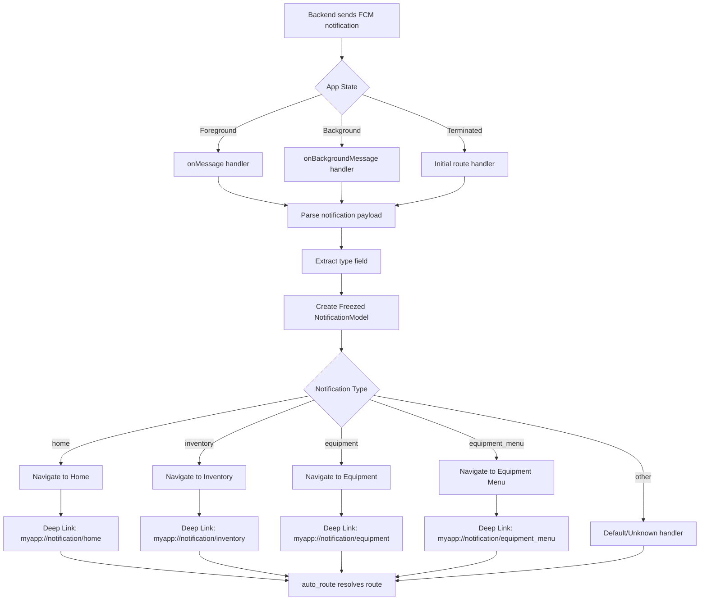

# Firebase Cloud Messaging Implementation Roadmap
## Complete End-to-End Guide for Flutter with Deep Linking & Navigation

---

## Table of Contents

1. [Overview](#overview)
2. [Project Structure](#project-structure)
3. [Phase 1: Firebase Project Setup](#phase-1-firebase-project-setup)
4. [Phase 2: Flutter Dependencies](#phase-2-flutter-dependencies)
5. [Phase 3: Android Configuration](#phase-3-android-configuration)
6. [Phase 4: iOS Configuration](#phase-4-ios-configuration)
7. [Phase 5: Notification Models (Freezed)](#phase-5-notification-models-freezed)
8. [Phase 6: Deep Link Configuration](#phase-6-deep-link-configuration)
9. [Phase 7: Notification Service Architecture](#phase-7-notification-service-architecture)
10. [Phase 8: Navigation Setup with auto_route](#phase-8-navigation-setup-with-auto_route)
11. [Phase 9: Notification Handler Implementation](#phase-9-notification-handler-implementation)
12. [Phase 10: Testing Strategy](#phase-10-testing-strategy)
13. [Phase 11: Packaging for Reuse](#phase-11-packaging-for-reuse)
14. [Phase 12: Integration Checklist](#phase-12-integration-checklist)

---

## Overview

This roadmap provides a comprehensive, step-by-step guide to implement Firebase Cloud Messaging (FCM) in a Flutter application with:
- **Deep linking** for navigation based on notification types
- **Freezed models** for type-safe notification payloads
- **auto_route** for declarative navigation
- **Extensible architecture** supporting dynamic notification types
- **Full payload support** (type, IDs, metadata, timestamps)
- **All app state handling** (foreground, background, terminated)

### Architecture Flow



---

## Project Structure

```
flutter_notification/
├── lib/
│   ├── main.dart
│   ├── app/
│   │   ├── app_router.dart              # auto_route configuration
│   │   └── app_router.gr.dart           # Generated routes
│   ├── core/
│   │   ├── constants/
│   │   │   └── app_constants.dart        # Deep link scheme, notification types
│   │   └── utils/
│   │       └── logger.dart              # Logging utility
│   ├── features/
│   │   ├── notifications/
│   │   │   ├── data/
│   │   │   │   ├── models/
│   │   │   │   │   └── notification_model.dart    # Freezed model
│   │   │   │   └── dto/
│   │   │   │       └── fcm_payload_dto.dart       # FCM payload parsing
│   │   │   ├── domain/
│   │   │   │   ├── entities/
│   │   │   │   │   └── notification_entity.dart
│   │   │   │   └── repositories/
│   │   │   │       └── notification_repository.dart
│   │   │   └── presentation/
│   │   │       ├── services/
│   │   │       │   ├── fcm_service.dart            # Main FCM handler
│   │   │       │   ├── notification_handler.dart  # Business logic
│   │   │       │   └── deep_link_service.dart      # Deep link resolver
│   │   │       └── providers/
│   │   │           └── notification_provider.dart # State management (optional)
│   │   ├── home/
│   │   │   └── presentation/
│   │   │       └── pages/
│   │   │           └── home_page.dart
│   │   ├── inventory/
│   │   │   └── presentation/
│   │   │       └── pages/
│   │   │           └── inventory_page.dart
│   │   ├── equipment/
│   │   │   └── presentation/
│   │   │       ├── pages/
│   │   │       │   ├── equipment_page.dart
│   │   │       │   └── equipment_menu_page.dart
│   │   │       └── widgets/
│   │   └── navigation/
│   │       └── navigation_service.dart
│   └── firebase_options.dart            # Generated by FlutterFire CLI
├── android/
│   ├── app/
│   │   ├── build.gradle.kts
│   │   └── src/
│   │       └── main/
│   │           ├── AndroidManifest.xml
│   │           └── kotlin/
│   │               └── MainActivity.kt
│   └── google-services.json             # From Firebase Console
├── ios/
│   ├── Runner/
│   │   ├── Info.plist
│   │   ├── GoogleService-Info.plist    # From Firebase Console
│   │   └── AppDelegate.swift
│   └── Runner.xcodeproj/
└── pubspec.yaml
```

---

## Phase 1: Firebase Project Setup

### 1.1 Firebase Console Configuration

1. **Create/Select Firebase Project**
   - Go to [Firebase Console](https://console.firebase.google.com/)
   - Select existing project or create new one
   - Enable Cloud Messaging API

2. **Android App Registration**
   - Add Android app to Firebase project
   - Package name: `com.example.flutter_notification` (or your package)
   - Download `google-services.json`
   - Place in `android/app/` directory

3. **iOS App Registration**
   - Add iOS app to Firebase project
   - Bundle ID: Match your iOS bundle identifier
   - Download `GoogleService-Info.plist`
   - Place in `ios/Runner/` directory

4. **Cloud Messaging Configuration**
   - Enable Cloud Messaging in Firebase Console
   - Note Server Key (for backend team)
   - Configure APNs (for iOS) - upload APNs certificate/key

### 1.2 FlutterFire CLI Installation

```bash
# Install FlutterFire CLI globally
dart pub global activate flutterfire_cli

# Configure Firebase for Flutter project
flutterfire configure
```

This will:
- Generate `lib/firebase_options.dart`
- Link your Flutter app to Firebase projects
- Configure platform-specific files

---

## Phase 2: Flutter Dependencies

### 2.1 Update `pubspec.yaml`

Add the following dependencies:

```yaml
dependencies:
  flutter:
    sdk: flutter
  
  # Firebase
  firebase_core: ^3.6.0
  firebase_messaging: ^15.1.3
  
  # Freezed for models
  freezed_annotation: ^2.4.4
  json_annotation: ^4.9.0
  
  # Navigation
  auto_route: ^9.2.2
  
  # Deep linking
  go_router: ^14.2.7  # Alternative if auto_route doesn't handle deep links well
  # OR use uni_links: ^3.0.0 for custom scheme handling
  
  # State management (optional, choose one)
  provider: ^6.1.2
  # OR riverpod: ^2.6.1
  # OR bloc: ^8.1.6
  
  # Utilities
  logger: ^2.4.0
  equatable: ^2.0.5

dev_dependencies:
  flutter_test:
    sdk: flutter
  flutter_lints: ^5.0.0
  
  # Code generation
  build_runner: ^2.4.13
  freezed: ^2.5.7
  json_serializable: ^6.8.0
  auto_route_generator: ^9.0.0
```

### 2.2 Install Dependencies

```bash
flutter pub get
```

---

## Phase 3: Android Configuration

### 3.1 Update `android/app/build.gradle.kts`

Add Google Services plugin:

```kotlin
plugins {
    id("com.android.application")
    id("kotlin-android")
    id("dev.flutter.flutter-gradle-plugin")
    id("com.google.gms.google-services")  // Add this
}

dependencies {
    // Firebase
    implementation(platform("com.google.firebase:firebase-bom:33.7.0"))
    implementation("com.google.firebase:firebase-messaging")
}
```

### 3.2 Update `android/build.gradle.kts`

Add Google Services classpath:

```kotlin
buildscript {
    repositories {
        google()
        mavenCentral()
    }
    dependencies {
        classpath("com.android.tools.build:gradle:8.1.0")
        classpath("com.google.gms:google-services:4.4.2")  // Add this
        classpath("org.jetbrains.kotlin:kotlin-gradle-plugin:1.9.0")
    }
}
```

### 3.3 Update `android/app/src/main/AndroidManifest.xml`

Add permissions and deep link intent filters:

```xml
<manifest xmlns:android="http://schemas.android.com/apk/res/android">
    <!-- Internet permission for FCM -->
    <uses-permission android:name="android.permission.INTERNET"/>
    <uses-permission android:name="android.permission.POST_NOTIFICATIONS"/>
    
    <application
        android:label="flutter_notification"
        android:name="${applicationName}"
        android:icon="@mipmap/ic_launcher">
        
        <activity
            android:name=".MainActivity"
            android:exported="true"
            android:launchMode="singleTop"
            android:theme="@style/LaunchTheme"
            android:configChanges="orientation|keyboardHidden|keyboard|screenSize|smallestScreenSize|locale|layoutDirection|fontScale|screenLayout|density|uiMode"
            android:hardwareAccelerated="true"
            android:windowSoftInputMode="adjustResize">
            
            <!-- Default launcher intent -->
            <intent-filter>
                <action android:name="android.intent.action.MAIN"/>
                <category android:name="android.intent.category.LAUNCHER"/>
            </intent-filter>
            
            <!-- Deep link intent filter for custom scheme -->
            <intent-filter>
                <action android:name="android.intent.action.VIEW"/>
                <category android:name="android.intent.category.DEFAULT"/>
                <category android:name="android.intent.category.BROWSABLE"/>
                <data android:scheme="myapp" android:host="notification"/>
            </intent-filter>
            
            <!-- FCM default notification channel -->
            <meta-data
                android:name="com.google.firebase.messaging.default_notification_channel_id"
                android:value="high_importance_channel"/>
        </activity>
        
        <!-- FCM default notification icon -->
        <meta-data
            android:name="com.google.firebase.messaging.default_notification_icon"
            android:resource="@drawable/ic_notification"/>
        
        <meta-data
            android:name="flutterEmbedding"
            android:value="2"/>
    </application>
</manifest>
```

### 3.4 Create Notification Icon (Optional)

Create `android/app/src/main/res/drawable/ic_notification.xml`:

```xml
<vector xmlns:android="http://schemas.android.com/apk/res/android"
    android:width="24dp"
    android:height="24dp"
    android:viewportWidth="24"
    android:viewportHeight="24">
    <path
        android:fillColor="#FFFFFF"
        android:pathData="M12,22c1.1,0 2,-0.9 2,-2h-4c0,1.1 0.89,2 2,2zM18,16v-5c0,-3.07 -1.64,-5.64 -4.5,-6.32V4c0,-0.83 -0.67,-1.5 -1.5,-1.5s-1.5,0.67 -1.5,1.5v0.68C7.63,5.36 6,7.92 6,11v5l-2,2v1h16v-1l-2,-2z"/>
</vector>
```

### 3.5 Update `MainActivity.kt`

```kotlin
package com.example.flutter_notification

import io.flutter.embedding.android.FlutterActivity

class MainActivity: FlutterActivity() {
    // No additional code needed for basic setup
    // Deep linking handled by Flutter plugins
}
```

---

## Phase 4: iOS Configuration

### 4.1 Update `ios/Podfile`

Ensure minimum iOS version:

```ruby
platform :ios, '13.0'  # Minimum for FCM
```

### 4.2 Update `ios/Runner/Info.plist`

Add notification permissions and URL scheme:

```xml
<key>UIBackgroundModes</key>
<array>
    <string>remote-notification</string>
</array>

<!-- Deep link URL scheme -->
<key>CFBundleURLTypes</key>
<array>
    <dict>
        <key>CFBundleTypeRole</key>
        <string>Editor</string>
        <key>CFBundleURLSchemes</key>
        <array>
            <string>myapp</string>
        </array>
    </dict>
</array>
```

### 4.3 Update `ios/Runner/AppDelegate.swift`

```swift
import UIKit
import Flutter
import FirebaseCore
import FirebaseMessaging

@UIApplicationMain
@objc class AppDelegate: FlutterAppDelegate {
  override func application(
    _ application: UIApplication,
    didFinishLaunchingWithOptions launchOptions: [UIApplication.LaunchOptionsKey: Any]?
  ) -> Bool {
    FirebaseApp.configure()
    
    // Request notification permissions
    if #available(iOS 10.0, *) {
      UNUserNotificationCenter.current().delegate = self
      let authOptions: UNAuthorizationOptions = [.alert, .badge, .sound]
      UNUserNotificationCenter.current().requestAuthorization(
        options: authOptions,
        completionHandler: { _, _ in }
      )
    } else {
      let settings: UIUserNotificationSettings =
        UIUserNotificationSettings(types: [.alert, .badge, .sound], categories: nil)
      application.registerUserNotificationSettings(settings)
    }
    
    application.registerForRemoteNotifications()
    
    GeneratedPluginRegistrant.register(with: self)
    return super.application(application, didFinishLaunchingWithOptions: launchOptions)
  }
  
  // Handle FCM token refresh
  override func application(_ application: UIApplication,
    didRegisterForRemoteNotificationsWithDeviceToken deviceToken: Data) {
    Messaging.messaging().apnsToken = deviceToken
  }
}
```

### 4.4 Enable Push Notifications in Xcode

1. Open `ios/Runner.xcworkspace` in Xcode
2. Select Runner target
3. Go to "Signing & Capabilities"
4. Click "+ Capability"
5. Add "Push Notifications"
6. Add "Background Modes" → Enable "Remote notifications"

---

## Phase 5: Notification Models (Freezed)

### 5.1 Create Notification Model

**File: `lib/features/notifications/data/models/notification_model.dart`**

```dart
import 'package:freezed_annotation/freezed_annotation.dart';

part 'notification_model.freezed.dart';
part 'notification_model.g.dart';

@freezed
class NotificationModel with _$NotificationModel {
  const factory NotificationModel({
    required String type,
    String? title,
    String? body,
    Map<String, dynamic>? data,
    String? equipmentId,
    String? inventoryId,
    String? userId,
    @JsonKey(name: 'timestamp') DateTime? timestamp,
    Map<String, dynamic>? metadata,
  }) = _NotificationModel;

  factory NotificationModel.fromJson(Map<String, dynamic> json) =>
      _$NotificationModelFromJson(json);
}

// Extension for type-safe navigation
extension NotificationModelExtension on NotificationModel {
  bool get isHome => type == 'home';
  bool get isInventory => type == 'inventory';
  bool get isEquipment => type == 'equipment';
  bool get isEquipmentMenu => type == 'equipment_menu';
  
  String get deepLinkPath {
    switch (type) {
      case 'home':
        return '/home';
      case 'inventory':
        return '/inventory';
      case 'equipment':
        return '/equipment/${equipmentId ?? ''}';
      case 'equipment_menu':
        return '/equipment/menu/${equipmentId ?? ''}';
      default:
        return '/home';
    }
  }
  
  String get deepLinkUri {
    return 'myapp://notification/$type${equipmentId != null ? '/$equipmentId' : ''}';
  }
}
```

### 5.2 Create FCM Payload DTO

**File: `lib/features/notifications/data/dto/fcm_payload_dto.dart`**

```dart
import 'package:firebase_messaging/firebase_messaging.dart';
import '../models/notification_model.dart';

class FcmPayloadDto {
  static NotificationModel fromRemoteMessage(RemoteMessage message) {
    final data = message.data;
    final notification = message.notification;
    
    return NotificationModel(
      type: data['type'] as String? ?? 'unknown',
      title: notification?.title ?? data['title'] as String?,
      body: notification?.body ?? data['body'] as String?,
      data: data,
      equipmentId: data['equipment_id'] as String? ?? data['equipmentId'] as String?,
      inventoryId: data['inventory_id'] as String? ?? data['inventoryId'] as String?,
      userId: data['user_id'] as String? ?? data['userId'] as String?,
      timestamp: message.sentTime,
      metadata: data['metadata'] as Map<String, dynamic>?,
    );
  }
  
  static NotificationModel? fromInitialMessage(Map<String, dynamic>? data) {
    if (data == null) return null;
    
    return NotificationModel(
      type: data['type'] as String? ?? 'unknown',
      title: data['title'] as String?,
      body: data['body'] as String?,
      data: data,
      equipmentId: data['equipment_id'] as String? ?? data['equipmentId'] as String?,
      inventoryId: data['inventory_id'] as String? ?? data['inventoryId'] as String?,
      userId: data['user_id'] as String? ?? data['userId'] as String?,
      timestamp: DateTime.now(),
      metadata: data['metadata'] as Map<String, dynamic>?,
    );
  }
}
```

### 5.3 Generate Freezed Code

```bash
flutter pub run build_runner build --delete-conflicting-outputs
```

---

## Phase 6: Deep Link Configuration

### 6.1 Create App Constants

**File: `lib/core/constants/app_constants.dart`**

```dart
class AppConstants {
  // Deep link scheme
  static const String deepLinkScheme = 'myapp';
  static const String deepLinkHost = 'notification';
  
  // Notification types
  static const String notificationTypeHome = 'home';
  static const String notificationTypeInventory = 'inventory';
  static const String notificationTypeEquipment = 'equipment';
  static const String notificationTypeEquipmentMenu = 'equipment_menu';
  
  // Deep link patterns
  static const String deepLinkPattern = '$deepLinkScheme://$deepLinkHost';
  
  // Route paths
  static const String routeHome = '/home';
  static const String routeInventory = '/inventory';
  static const String routeEquipment = '/equipment';
  static const String routeEquipmentMenu = '/equipment/menu';
}
```

### 6.2 Create Deep Link Service

**File: `lib/features/notifications/presentation/services/deep_link_service.dart`**

```dart
import 'package:logger/logger.dart';
import '../../../core/constants/app_constants.dart';
import '../../data/models/notification_model.dart';

class DeepLinkService {
  final Logger _logger = Logger();
  
  /// Parse deep link URI to NotificationModel
  NotificationModel? parseDeepLink(String? uri) {
    if (uri == null || uri.isEmpty) return null;
    
    try {
      final uriParsed = Uri.parse(uri);
      
      if (uriParsed.scheme != AppConstants.deepLinkScheme ||
          uriParsed.host != AppConstants.deepLinkHost) {
        return null;
      }
      
      final pathSegments = uriParsed.pathSegments;
      if (pathSegments.isEmpty) return null;
      
      final type = pathSegments[0];
      final id = pathSegments.length > 1 ? pathSegments[1] : null;
      
      return NotificationModel(
        type: type,
        equipmentId: type.contains('equipment') ? id : null,
        inventoryId: type == 'inventory' ? id : null,
        data: uriParsed.queryParameters,
      );
    } catch (e) {
      _logger.e('Error parsing deep link: $e');
      return null;
    }
  }
  
  /// Generate deep link URI from NotificationModel
  String generateDeepLink(NotificationModel notification) {
    return notification.deepLinkUri;
  }
  
  /// Extract route path from NotificationModel
  String getRoutePath(NotificationModel notification) {
    return notification.deepLinkPath;
  }
}
```

---

## Phase 7: Notification Service Architecture

### 7.1 Create FCM Service

**File: `lib/features/notifications/presentation/services/fcm_service.dart`**

```dart
import 'dart:async';
import 'package:firebase_core/firebase_core.dart';
import 'package:firebase_messaging/firebase_messaging.dart';
import 'package:flutter/foundation.dart';
import 'package:logger/logger.dart';
import '../../data/dto/fcm_payload_dto.dart';
import '../../data/models/notification_model.dart';
import 'notification_handler.dart';

/// Top-level function for background message handling
@pragma('vm:entry-point')
Future<void> firebaseMessagingBackgroundHandler(RemoteMessage message) async {
  await Firebase.initializeApp();
  final handler = NotificationHandler();
  final notification = FcmPayloadDto.fromRemoteMessage(message);
  await handler.handleBackgroundNotification(notification);
}

class FcmService {
  final FirebaseMessaging _messaging = FirebaseMessaging.instance;
  final NotificationHandler _handler = NotificationHandler();
  final Logger _logger = Logger();
  
  StreamSubscription<RemoteMessage>? _onMessageSubscription;
  StreamSubscription<String>? _onTokenRefreshSubscription;
  
  /// Initialize FCM service
  Future<void> initialize() async {
    try {
      // Request permissions
      final settings = await _messaging.requestPermission(
        alert: true,
        announcement: false,
        badge: true,
        carPlay: false,
        criticalAlert: false,
        provisional: false,
        sound: true,
      );
      
      _logger.i('Notification permission: ${settings.authorizationStatus}');
      
      // Get FCM token
      final token = await _messaging.getToken();
      _logger.i('FCM Token: $token');
      // TODO: Send token to backend
      
      // Setup background message handler
      FirebaseMessaging.onBackgroundMessage(firebaseMessagingBackgroundHandler);
      
      // Listen for foreground messages
      _onMessageSubscription = FirebaseMessaging.onMessage.listen(_handleForegroundMessage);
      
      // Listen for token refresh
      _onTokenRefreshSubscription = _messaging.onTokenRefresh.listen(_handleTokenRefresh);
      
      // Handle notification when app is opened from terminated state
      final initialMessage = await _messaging.getInitialMessage();
      if (initialMessage != null) {
        _handleInitialMessage(initialMessage);
      }
      
      // Handle notification when app is opened from background
      FirebaseMessaging.onMessageOpenedApp.listen(_handleMessageOpenedApp);
      
    } catch (e) {
      _logger.e('Error initializing FCM: $e');
    }
  }
  
  /// Handle foreground messages
  void _handleForegroundMessage(RemoteMessage message) {
    _logger.i('Foreground message received: ${message.messageId}');
    final notification = FcmPayloadDto.fromRemoteMessage(message);
    _handler.handleForegroundNotification(notification);
  }
  
  /// Handle initial message (app opened from terminated state)
  void _handleInitialMessage(RemoteMessage message) {
    _logger.i('Initial message received: ${message.messageId}');
    final notification = FcmPayloadDto.fromRemoteMessage(message);
    _handler.handleInitialNotification(notification);
  }
  
  /// Handle message opened from background
  void _handleMessageOpenedApp(RemoteMessage message) {
    _logger.i('Message opened from background: ${message.messageId}');
    final notification = FcmPayloadDto.fromRemoteMessage(message);
    _handler.handleBackgroundOpenedNotification(notification);
  }
  
  /// Handle token refresh
  void _handleTokenRefresh(String token) {
    _logger.i('FCM Token refreshed: $token');
    // TODO: Send updated token to backend
  }
  
  /// Get current FCM token
  Future<String?> getToken() async {
    return await _messaging.getToken();
  }
  
  /// Subscribe to topic
  Future<void> subscribeToTopic(String topic) async {
    await _messaging.subscribeToTopic(topic);
    _logger.i('Subscribed to topic: $topic');
  }
  
  /// Unsubscribe from topic
  Future<void> unsubscribeFromTopic(String topic) async {
    await _messaging.unsubscribeFromTopic(topic);
    _logger.i('Unsubscribed from topic: $topic');
  }
  
  /// Dispose resources
  void dispose() {
    _onMessageSubscription?.cancel();
    _onTokenRefreshSubscription?.cancel();
  }
}
```

### 7.2 Create Notification Handler

**File: `lib/features/notifications/presentation/services/notification_handler.dart`**

```dart
import 'package:logger/logger.dart';
import '../../data/models/notification_model.dart';
import 'deep_link_service.dart';
import '../../../navigation/navigation_service.dart';

class NotificationHandler {
  final DeepLinkService _deepLinkService = DeepLinkService();
  final NavigationService _navigationService = NavigationService();
  final Logger _logger = Logger();
  
  /// Handle notification when app is in foreground
  void handleForegroundNotification(NotificationModel notification) {
    _logger.i('Handling foreground notification: ${notification.type}');
    
    // Show local notification or in-app banner
    // You can use flutter_local_notifications for this
    // For now, we'll just log it
    _logger.d('Notification data: ${notification.data}');
    
    // Optionally show a snackbar or dialog
    // _showInAppNotification(notification);
  }
  
  /// Handle notification when app is opened from terminated state
  void handleInitialNotification(NotificationModel notification) {
    _logger.i('Handling initial notification: ${notification.type}');
    _navigateFromNotification(notification);
  }
  
  /// Handle notification when app is opened from background
  void handleBackgroundOpenedNotification(NotificationModel notification) {
    _logger.i('Handling background opened notification: ${notification.type}');
    _navigateFromNotification(notification);
  }
  
  /// Handle notification in background (isolate)
  Future<void> handleBackgroundNotification(NotificationModel notification) async {
    _logger.i('Handling background notification: ${notification.type}');
    // Perform any background processing here
    // Note: Navigation is not possible in background isolate
  }
  
  /// Navigate based on notification type
  void _navigateFromNotification(NotificationModel notification) {
    final routePath = _deepLinkService.getRoutePath(notification);
    _logger.i('Navigating to: $routePath');
    
    _navigationService.navigateToRoute(
      routePath,
      arguments: notification,
    );
  }
}
```

---

## Phase 8: Navigation Setup with auto_route

### 8.1 Create App Router

**File: `lib/app/app_router.dart`**

```dart
import 'package:auto_route/auto_route.dart';
import 'package:flutter/material.dart';
import '../features/home/presentation/pages/home_page.dart';
import '../features/inventory/presentation/pages/inventory_page.dart';
import '../features/equipment/presentation/pages/equipment_page.dart';
import '../features/equipment/presentation/pages/equipment_menu_page.dart';
import '../features/notifications/data/models/notification_model.dart';

part 'app_router.gr.dart';

@AutoRouterConfig()
class AppRouter extends _$AppRouter {
  @override
  List<AutoRoute> get routes => [
    AutoRoute(
      page: HomeRoute.page,
      path: '/home',
      initial: true,
    ),
    AutoRoute(
      page: InventoryRoute.page,
      path: '/inventory',
    ),
    AutoRoute(
      page: EquipmentRoute.page,
      path: '/equipment/:equipmentId',
    ),
    AutoRoute(
      page: EquipmentMenuRoute.page,
      path: '/equipment/menu/:equipmentId',
    ),
  ];
}
```

### 8.2 Create Route Pages

**File: `lib/features/home/presentation/pages/home_page.dart`**

```dart
import 'package:auto_route/auto_route.dart';
import 'package:flutter/material.dart';

@RoutePage()
class HomePage extends StatelessWidget {
  const HomePage({super.key});

  @override
  Widget build(BuildContext context) {
    return Scaffold(
      appBar: AppBar(title: const Text('Home')),
      body: const Center(child: Text('Home Page')),
    );
  }
}
```

**File: `lib/features/inventory/presentation/pages/inventory_page.dart`**

```dart
import 'package:auto_route/auto_route.dart';
import 'package:flutter/material.dart';

@RoutePage()
class InventoryPage extends StatelessWidget {
  const InventoryPage({super.key});

  @override
  Widget build(BuildContext context) {
    return Scaffold(
      appBar: AppBar(title: const Text('Inventory')),
      body: const Center(child: Text('Inventory Page')),
    );
  }
}
```

**File: `lib/features/equipment/presentation/pages/equipment_page.dart`**

```dart
import 'package:auto_route/auto_route.dart';
import 'package:flutter/material.dart';

@RoutePage()
class EquipmentPage extends StatelessWidget {
  final String equipmentId;
  
  const EquipmentPage({
    super.key,
    @PathParam('equipmentId') required this.equipmentId,
  });

  @override
  Widget build(BuildContext context) {
    return Scaffold(
      appBar: AppBar(title: Text('Equipment: $equipmentId')),
      body: Center(child: Text('Equipment Page: $equipmentId')),
    );
  }
}
```

**File: `lib/features/equipment/presentation/pages/equipment_menu_page.dart`**

```dart
import 'package:auto_route/auto_route.dart';
import 'package:flutter/material.dart';

@RoutePage()
class EquipmentMenuPage extends StatelessWidget {
  final String equipmentId;
  
  const EquipmentMenuPage({
    super.key,
    @PathParam('equipmentId') required this.equipmentId,
  });

  @override
  Widget build(BuildContext context) {
    return Scaffold(
      appBar: AppBar(title: Text('Equipment Menu: $equipmentId')),
      body: Center(child: Text('Equipment Menu Page: $equipmentId')),
    );
  }
}
```

### 8.3 Create Navigation Service

**File: `lib/features/navigation/navigation_service.dart`**

```dart
import 'package:auto_route/auto_route.dart';
import 'package:flutter/material.dart';
import '../../app/app_router.dart';
import '../notifications/data/models/notification_model.dart';

class NavigationService {
  final AppRouter _router = AppRouter();
  
  /// Navigate to route based on path
  void navigateToRoute(String routePath, {NotificationModel? arguments}) {
    final context = _router.navigatorKey.currentContext;
    if (context == null) return;
    
    try {
      switch (routePath) {
        case '/home':
          context.router.pushAndClearStack(const HomeRoute());
          break;
        case '/inventory':
          context.router.pushAndClearStack(const InventoryRoute());
          break;
        case '/equipment':
          if (arguments?.equipmentId != null) {
            context.router.pushAndClearStack(
              EquipmentRoute(equipmentId: arguments!.equipmentId!),
            );
          }
          break;
        case '/equipment/menu':
          if (arguments?.equipmentId != null) {
            context.router.pushAndClearStack(
              EquipmentMenuRoute(equipmentId: arguments!.equipmentId!),
            );
          }
          break;
        default:
          context.router.pushAndClearStack(const HomeRoute());
      }
    } catch (e) {
      // Fallback to home
      context.router.pushAndClearStack(const HomeRoute());
    }
  }
  
  AppRouter get router => _router;
}
```

### 8.4 Generate Routes

```bash
flutter pub run build_runner build --delete-conflicting-outputs
```

### 8.5 Update `main.dart`

**File: `lib/main.dart`**

```dart
import 'package:flutter/material.dart';
import 'package:firebase_core/firebase_core.dart';
import 'firebase_options.dart';
import 'app/app_router.dart';
import 'features/notifications/presentation/services/fcm_service.dart';

void main() async {
  WidgetsFlutterBinding.ensureInitialized();
  
  // Initialize Firebase
  await Firebase.initializeApp(
    options: DefaultFirebaseOptions.currentPlatform,
  );
  
  // Initialize FCM
  final fcmService = FcmService();
  await fcmService.initialize();
  
  runApp(MyApp(fcmService: fcmService));
}

class MyApp extends StatelessWidget {
  final FcmService fcmService;
  
  const MyApp({super.key, required this.fcmService});

  @override
  Widget build(BuildContext context) {
    final appRouter = AppRouter();
    
    return MaterialApp.router(
      title: 'Flutter Notification',
      routerConfig: appRouter.config(),
      theme: ThemeData(
        colorScheme: ColorScheme.fromSeed(seedColor: Colors.deepPurple),
        useMaterial3: true,
      ),
    );
  }
}
```

---

## Phase 9: Notification Handler Implementation

### 9.1 Backend Notification Payload Schema

The backend should send notifications in this format:

```json
{
  "notification": {
    "title": "New Equipment Alert",
    "body": "Equipment #123 requires attention"
  },
  "data": {
    "type": "equipment",
    "equipment_id": "123",
    "user_id": "user456",
    "metadata": {
      "priority": "high",
      "category": "maintenance"
    }
  }
}
```

### 9.2 Enhanced Notification Handler

Update `notification_handler.dart` to handle all notification types dynamically:

```dart
// Add to NotificationHandler class

Map<String, String> _getRouteMapping() {
  return {
    'home': '/home',
    'inventory': '/inventory',
    'equipment': '/equipment',
    'equipment_menu': '/equipment/menu',
  };
}

void _navigateFromNotification(NotificationModel notification) {
  final routeMapping = _getRouteMapping();
  final baseRoute = routeMapping[notification.type] ?? '/home';
  
  String fullRoute = baseRoute;
  if (notification.equipmentId != null && 
      (notification.type == 'equipment' || notification.type == 'equipment_menu')) {
    fullRoute = '$baseRoute/${notification.equipmentId}';
  }
  
  _navigationService.navigateToRoute(fullRoute, arguments: notification);
}
```

---

## Phase 10: Testing Strategy

### 10.1 Unit Tests

**File: `test/features/notifications/data/models/notification_model_test.dart`**

```dart
import 'package:flutter_test/flutter_test.dart';
import 'package:flutter_notification/features/notifications/data/models/notification_model.dart';

void main() {
  group('NotificationModel', () {
    test('should create from JSON', () {
      final json = {
        'type': 'equipment',
        'equipment_id': '123',
        'title': 'Test',
      };
      
      final model = NotificationModel.fromJson(json);
      
      expect(model.type, 'equipment');
      expect(model.equipmentId, '123');
      expect(model.title, 'Test');
    });
    
    test('should generate correct deep link', () {
      final model = NotificationModel(
        type: 'equipment',
        equipmentId: '123',
      );
      
      expect(model.deepLinkUri, 'myapp://notification/equipment/123');
    });
  });
}
```

### 10.2 Integration Tests

**File: `test/features/notifications/presentation/services/fcm_service_test.dart`**

```dart
import 'package:flutter_test/flutter_test.dart';
import 'package:firebase_messaging/firebase_messaging.dart';
// Add integration tests for FCM service
```

### 10.3 Manual Testing Checklist

- [ ] **Foreground Testing**
  - [ ] Send notification while app is open
  - [ ] Verify notification is received
  - [ ] Verify navigation occurs on tap

- [ ] **Background Testing**
  - [ ] Send notification while app is in background
  - [ ] Tap notification
  - [ ] Verify app opens and navigates correctly

- [ ] **Terminated Testing**
  - [ ] Force close app
  - [ ] Send notification
  - [ ] Tap notification
  - [ ] Verify app launches and navigates correctly

- [ ] **Deep Link Testing**
  - [ ] Test each notification type
  - [ ] Verify correct route navigation
  - [ ] Test with and without IDs

- [ ] **Platform Testing**
  - [ ] Test on Android device
  - [ ] Test on iOS device
  - [ ] Test on Android emulator
  - [ ] Test on iOS simulator

### 10.4 Test Notification Payloads

Create test payloads for each notification type:

```dart
// test/fixtures/notification_payloads.dart

final homeNotificationPayload = {
  'data': {'type': 'home'},
  'notification': {'title': 'Home', 'body': 'Navigate to home'},
};

final inventoryNotificationPayload = {
  'data': {'type': 'inventory', 'inventory_id': 'inv123'},
  'notification': {'title': 'Inventory', 'body': 'Navigate to inventory'},
};

final equipmentNotificationPayload = {
  'data': {'type': 'equipment', 'equipment_id': 'eq456'},
  'notification': {'title': 'Equipment', 'body': 'Navigate to equipment'},
};
```

---

## Phase 11: Packaging for Reuse

### 11.1 Create Notification Package Structure

```
lib/
└── packages/
    └── notification_service/
        ├── pubspec.yaml
        ├── lib/
        │   ├── notification_service.dart
        │   ├── models/
        │   ├── services/
        │   └── utils/
        └── README.md
```

### 11.2 Extract Core Components

1. **Create `notification_service` package**
   - Move FCM service
   - Move notification models
   - Move deep link service
   - Move notification handler

2. **Create Interface/Abstract Classes**

```dart
// lib/packages/notification_service/lib/interfaces/notification_handler_interface.dart

abstract class NotificationHandlerInterface {
  void handleForegroundNotification(NotificationModel notification);
  void handleInitialNotification(NotificationModel notification);
  void handleBackgroundOpenedNotification(NotificationModel notification);
  Future<void> handleBackgroundNotification(NotificationModel notification);
}
```

3. **Create Configuration Class**

```dart
// lib/packages/notification_service/lib/config/notification_config.dart

class NotificationConfig {
  final String deepLinkScheme;
  final String deepLinkHost;
  final Map<String, String> routeMapping;
  final Function(String)? onTokenReceived;
  
  NotificationConfig({
    required this.deepLinkScheme,
    required this.deepLinkHost,
    required this.routeMapping,
    this.onTokenReceived,
  });
}
```

### 11.3 Usage in Main Project

```dart
// In main project
import 'package:notification_service/notification_service.dart';

void main() async {
  WidgetsFlutterBinding.ensureInitialized();
  await Firebase.initializeApp();
  
  final config = NotificationConfig(
    deepLinkScheme: 'myapp',
    deepLinkHost: 'notification',
    routeMapping: {
      'home': '/home',
      'inventory': '/inventory',
      // ...
    },
    onTokenReceived: (token) {
      // Send to backend
    },
  );
  
  await NotificationService.initialize(config);
  runApp(MyApp());
}
```

---

## Phase 12: Integration Checklist

### 12.1 Pre-Implementation Checklist

- [ ] Firebase project created
- [ ] Android app registered in Firebase
- [ ] iOS app registered in Firebase
- [ ] `google-services.json` downloaded and placed
- [ ] `GoogleService-Info.plist` downloaded and placed
- [ ] FlutterFire CLI installed and configured
- [ ] Dependencies added to `pubspec.yaml`

### 12.2 Implementation Checklist

- [ ] Android manifest updated
- [ ] iOS Info.plist updated
- [ ] iOS AppDelegate updated
- [ ] Notification models created (Freezed)
- [ ] FCM service implemented
- [ ] Notification handler implemented
- [ ] Deep link service implemented
- [ ] Navigation routes configured (auto_route)
- [ ] Main.dart updated with initialization
- [ ] Code generation run (`build_runner`)

### 12.3 Testing Checklist

- [ ] FCM token received and logged
- [ ] Foreground notifications working
- [ ] Background notifications working
- [ ] Terminated state notifications working
- [ ] Deep links working for all types
- [ ] Navigation working correctly
- [ ] All notification types tested
- [ ] Android testing completed
- [ ] iOS testing completed

### 12.4 Production Checklist

- [ ] Error handling implemented
- [ ] Logging configured
- [ ] Analytics integrated (optional)
- [ ] Token refresh handling
- [ ] Background processing optimized
- [ ] Memory leaks checked
- [ ] Performance tested
- [ ] Documentation updated

---

## Additional Considerations

### Error Handling

- Handle missing notification data gracefully
- Fallback to default route for unknown types
- Log errors for debugging
- Show user-friendly error messages

### Security

- Validate notification payloads
- Sanitize deep link parameters
- Implement rate limiting for notifications
- Secure FCM token transmission

### Performance

- Lazy load notification handlers
- Cache route mappings
- Optimize background processing
- Minimize app startup impact

### Analytics

- Track notification open rates
- Monitor navigation success/failure
- Log notification types received
- Track user engagement

---

## Troubleshooting

### Common Issues

1. **Notifications not received**
   - Check FCM token is valid
   - Verify permissions granted
   - Check Firebase configuration files
   - Verify backend is sending correctly

2. **Navigation not working**
   - Check deep link configuration
   - Verify route mappings
   - Check auto_route generation
   - Verify notification payload structure

3. **Background notifications not working**
   - Verify background handler is top-level function
   - Check iOS background modes enabled
   - Verify Android manifest configuration

4. **iOS notifications not working**
   - Check APNs certificate uploaded
   - Verify bundle ID matches
   - Check provisioning profile
   - Verify capabilities enabled

---

## Backend Integration Notes

### FCM Token Endpoint

The backend should provide an endpoint to register FCM tokens:

```
POST /api/notifications/register-token
Body: { "token": "fcm_token_here", "platform": "android|ios" }
```

### Notification Payload Format

Backend should send notifications in this format:

```json
{
  "to": "fcm_token_or_topic",
  "notification": {
    "title": "Notification Title",
    "body": "Notification Body"
  },
  "data": {
    "type": "equipment|inventory|home|equipment_menu",
    "equipment_id": "optional_equipment_id",
    "inventory_id": "optional_inventory_id",
    "user_id": "optional_user_id",
    "metadata": {
      "key": "value"
    }
  },
  "android": {
    "priority": "high",
    "notification": {
      "channel_id": "high_importance_channel"
    }
  },
  "apns": {
    "headers": {
      "apns-priority": "10"
    },
    "payload": {
      "aps": {
        "sound": "default",
        "badge": 1
      }
    }
  }
}
```

---

## Conclusion

This roadmap provides a complete, production-ready implementation of Firebase Cloud Messaging with deep linking and navigation in Flutter. Follow each phase sequentially, test thoroughly, and adapt the architecture to your specific needs.

For questions or issues, refer to:
- [Firebase Cloud Messaging Documentation](https://firebase.google.com/docs/cloud-messaging)
- [FlutterFire Documentation](https://firebase.flutter.dev/)
- [auto_route Documentation](https://pub.dev/packages/auto_route)
- [Freezed Documentation](https://pub.dev/packages/freezed)
